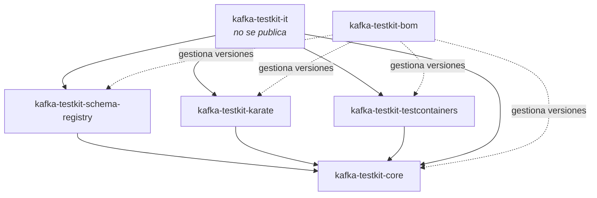
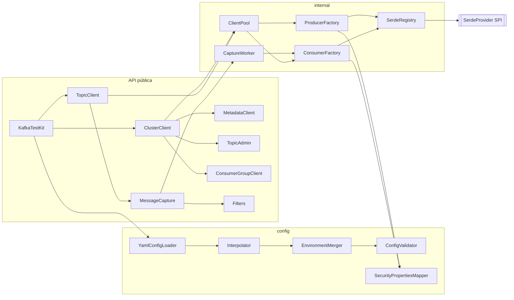
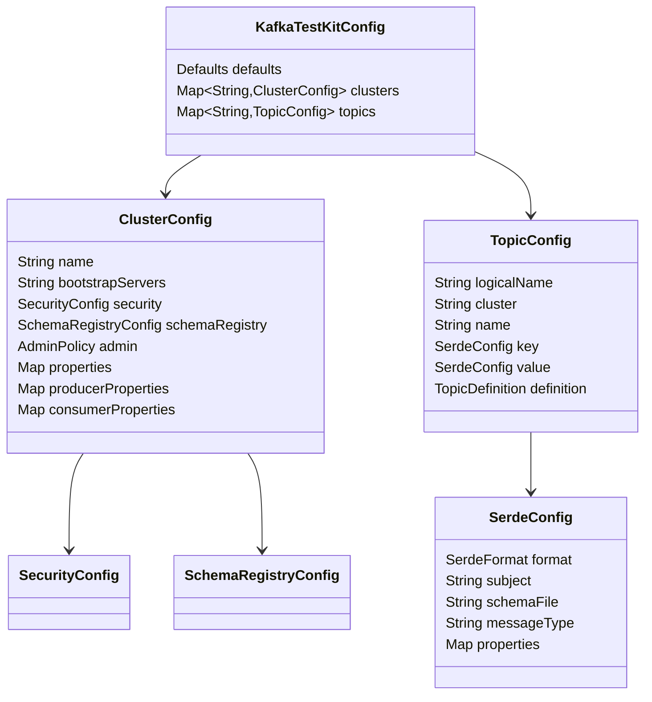
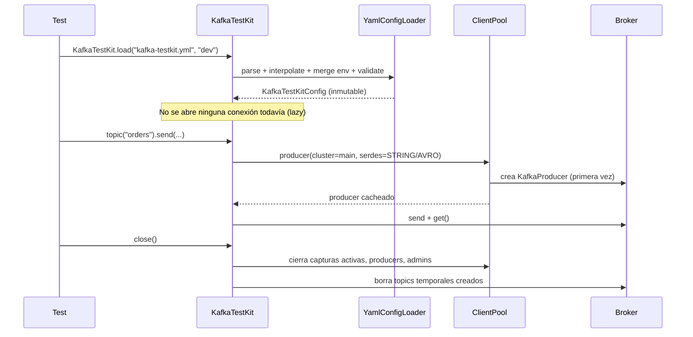

# 02 · Arquitectura

## 1. Principios de diseño

1. **La configuración manda.** El código de test habla con nombres lógicos (`kit.topic("orders")`), nunca con bootstrap servers, propiedades de seguridad ni nombres físicos. Cambiar de entorno = cambiar de YAML/entorno, no de código.
2. **Neutral respecto a la herramienta.** El núcleo es Java puro sin dependencias de Karate, JUnit ni Spring. Las integraciones son adaptadores finos.
3. **Todo mensaje es un `Map`.** Independientemente del formato (Avro, Protobuf, JSON, bytes), un mensaje consumido siempre se puede ver como `Map<String,Object>`/JSON, que es lo que Karate compara de forma nativa y lo más cómodo en AssertJ.
4. **Sin condiciones de carrera.** El patrón principal es *empezar a escuchar → actuar → esperar*, nunca *actuar → dormir → leer*.
5. **No invasiva.** Por defecto se lee con `assign()`+`seek()`, sin consumer group: los tests no alteran offsets de grupos reales ni provocan rebalanceos.
6. **Dependencias opcionales.** Schema Registry y Testcontainers van en módulos separados, descubiertos en tiempo de ejecución.
7. **Concurrencia segura.** El kit es thread-safe y compartible; no hay estado estático mutable salvo la caché explícita de la fachada Karate.
8. **Fallar pronto y con claridad.** La configuración se valida entera al cargarla; los errores indican ruta YAML, topic, partición y sugerencia.

## 2. Vista de módulos



| Módulo | Depende de | Dependencias externas principales |
|--------|------------|-----------------------------------|
| `kafka-testkit-core` | — | `kafka-clients`, `jackson-databind`, `jackson-dataformat-yaml`, `jackson-datatype-jsr310`, `json-path`, `slf4j-api` |
| `kafka-testkit-schema-registry` | core | `kafka-avro-serializer`, `kafka-protobuf-serializer`, `kafka-json-schema-serializer`, `kafka-schema-registry-client` (Confluent) |
| `kafka-testkit-karate` | core | `karate-core` (scope `provided`: lo trae el proyecto usuario) |
| `kafka-testkit-testcontainers` | core | `org.testcontainers:testcontainers-kafka` (Testcontainers 2.x), `junit-jupiter-api` (`provided`, para la extensión) |
| `kafka-testkit-it` | todos | `karate-junit6`, `junit-jupiter` (JUnit 6), `testcontainers-junit-jupiter`, `assertj`, `slf4j-simple` |

Un usuario de Karate con Avro añadiría:

```xml
<dependencyManagement>
  <dependencies>
    <dependency>
      <groupId>io.github.volumidev</groupId>
      <artifactId>kafka-testkit-bom</artifactId>
      <version>1.0.0</version>
      <type>pom</type>
      <scope>import</scope>
    </dependency>
  </dependencies>
</dependencyManagement>

<dependencies>
  <dependency>
    <groupId>io.github.volumidev</groupId>
    <artifactId>kafka-testkit-karate</artifactId>
    <scope>test</scope>
  </dependency>
  <dependency>
    <groupId>io.github.volumidev</groupId>
    <artifactId>kafka-testkit-schema-registry</artifactId>
    <scope>test</scope>
  </dependency>
</dependencies>

<repositories>
  <repository>
    <id>confluent</id>
    <url>https://packages.confluent.io/maven/</url>
  </repository>
</repositories>
```

## 3. Vista de componentes (core)



### Responsabilidades

| Componente | Responsabilidad |
|-----------|-----------------|
| `KafkaTestKit` | Punto de entrada. Carga configuración, crea `ClusterClient`/`TopicClient` bajo demanda, dueño del ciclo de vida de todos los recursos |
| `ClusterClient` | Operaciones a nivel de cluster: `metadata()`, `admin()`, `groups()`, y acceso a topics por nombre físico |
| `TopicClient` | Operaciones sobre un topic lógico: `send`, `read`, `capture` |
| `MessageCapture` | Consumidor en segundo plano + buffer + API de espera |
| `YamlConfigLoader` | Localiza y parsea el YAML (classpath, fichero, URL) |
| `Interpolator` | Resuelve `${...}` con variables de entorno y propiedades de sistema |
| `EnvironmentMerger` | Fusiona el bloque `environments.<env>` sobre la base (deep merge) |
| `ConfigValidator` | Valida semántica: referencias, formatos, ficheros, combinaciones de seguridad |
| `SecurityPropertiesMapper` | Traduce `security:` a propiedades nativas de Kafka |
| `ClientPool` | Cachea `Producer` y `Admin` por cluster/serdes; cierra todo al final |
| `SerdeRegistry` | Descubre `SerdeProvider` vía `ServiceLoader` y construye serdes por formato |

## 4. Modelo de dominio de configuración



Todas las clases de configuración son **records inmutables**. Tras cargar, nada puede modificar la configuración (salvo los *overrides* explícitos, ver §6).

## 5. Ciclo de vida



Reglas:

- **Carga perezosa**: `load()` solo lee y valida. Las conexiones se abren en el primer uso. Así un YAML con 5 clusters no obliga a que los 5 estén accesibles.
- **Opción de verificación temprana**: `kit.verifyConnectivity()` / `kit.cluster("main").ping()` para fallar al arrancar la suite si un cluster no responde.
- **Cierre ordenado** (`close()`, idempotente):
  1. Parar y cerrar capturas activas.
  2. Borrar topics temporales (`createTemporaryTopic`).
  3. `flush()` + `close()` de producers.
  4. `close()` de admins y del cliente de Schema Registry.
- Un `KafkaTestKit` registra opcionalmente un **shutdown hook** (activado por defecto en la fachada Karate) para no dejar recursos si el usuario olvida cerrar.

## 6. Overrides en tiempo de ejecución

Casos como Testcontainers necesitan cambiar el `bootstrapServers` tras arrancar el contenedor. En vez de mutar la configuración, se crea un kit nuevo con overrides:

```java
KafkaTestKit kit = KafkaTestKit.builder()
        .config("kafka-testkit.yml")
        .environment("local")
        .override("clusters.main.bootstrapServers", container.getBootstrapServers())
        .override("clusters.main.schemaRegistry.url", srUrl)
        .build();
```

Los overrides se aplican **después** del merge de entorno y **antes** de la validación, con la misma sintaxis de rutas que los mensajes de error.

## 7. Concurrencia

| Recurso | Estrategia |
|---------|------------|
| `KafkaTestKit`, `ClusterClient`, `TopicClient` | Thread-safe, sin estado mutable salvo cachés concurrentes |
| `KafkaProducer` | Thread-safe por diseño de Kafka → uno compartido por (cluster, serde clave, serde valor) |
| `Admin` | Thread-safe → uno por cluster |
| `KafkaConsumer` | **No** thread-safe → cada lectura/captura crea el suyo y lo usa desde un único hilo |
| `MessageCapture` | Un hilo worker (virtual thread) hace `poll()`; el buffer es un `CopyOnWriteArrayList` + `ReentrantLock`/`Condition` para notificar a los que esperan |
| `SchemaRegistryClient` | `CachedSchemaRegistryClient` es thread-safe → uno por cluster |

Los hilos de captura son **virtual threads** (Java 21) con nombre `kafka-testkit-capture-<topic>-<n>`, para poder tener muchas capturas en paralelo sin coste.

## 8. Decisiones de arquitectura (ADR resumidas)

### ADR-01 · Leer sin consumer group por defecto
- **Contexto**: con `subscribe()` hay que esperar al rebalanceo, se comprometen offsets y un `group.id` compartido puede robar mensajes al servicio bajo prueba.
- **Decisión**: `assign()` a todas las particiones + `seek()` explícito; `enable.auto.commit=false`; sin `group.id`.
- **Consecuencia**: arranque inmediato y determinista. Si alguien necesita probar con grupo, `ReadSpec.withGroup("x")` usa `subscribe()`.

### ADR-02 · Captura iniciada antes de la acción
- **Contexto**: leer "los últimos mensajes" después de la acción es frágil (mensajes de otros tests, tiempos).
- **Decisión**: `capture()` fija los offsets *end* de cada partición en el momento de crearse y solo ve lo que llega después.
- **Consecuencia**: aislamiento entre tests aunque compartan topic.

### ADR-03 · `Map` como representación universal
- **Decisión**: todos los serdes implementan `toMap(Object)`; `KafkaMessage.valueAsMap()` siempre funciona para formatos estructurados.
- **Consecuencia**: filtros y aserciones independientes del formato; Karate compara con `match` directamente.

### ADR-04 · Serdes por SPI
- **Decisión**: `ServiceLoader<SerdeProvider>`. Core trae los básicos; `schema-registry` registra Avro/Protobuf/JSON Schema.
- **Consecuencia**: sin dependencias Confluent en core; se pueden añadir formatos propios (p. ej. XML, Thrift).

### ADR-05 · Jackson para YAML
- **Alternativas**: SnakeYAML directo, Typesafe Config.
- **Decisión**: `jackson-dataformat-yaml` → mapeo directo a records, y Jackson ya se necesita para JSON.

### ADR-06 · Envío síncrono por defecto
- **Decisión**: `send()` espera el ack (`future.get(timeout)`), porque en tests el orden y la confirmación importan más que el throughput. Existe `sendAsync()` para casos de carga.

### ADR-07 · Virtual threads para capturas
- **Decisión**: Java 21 permite un hilo por captura sin coste relevante, simplificando el modelo (un consumidor = un hilo).

## 9. API pública vs interna

- Paquetes públicos: `io.github.volumidev.kafkatestkit`, `.config`, `.message`, `.capture`, `.admin`, `.serde`, `.exception`.
- Paquete `io.github.volumidev.kafkatestkit.internal.*`: implementación, sin garantías de compatibilidad.
- **Sin `module-info.java` por ahora.** `kafka-clients` (4.3.x) no declara nombre de módulo (ni `module-info` ni `Automatic-Module-Name`), así que un `requires kafka.clients` dependería del nombre del fichero `.jar` (Maven avisa de no publicar así). Core declara `Automatic-Module-Name: io.github.volumidev.kafkatestkit` en el manifiesto para reservar el nombre; se añadirá `module-info.java` cuando Kafka publique uno. La separación pública/`internal` se mantiene por convención y Checkstyle.
