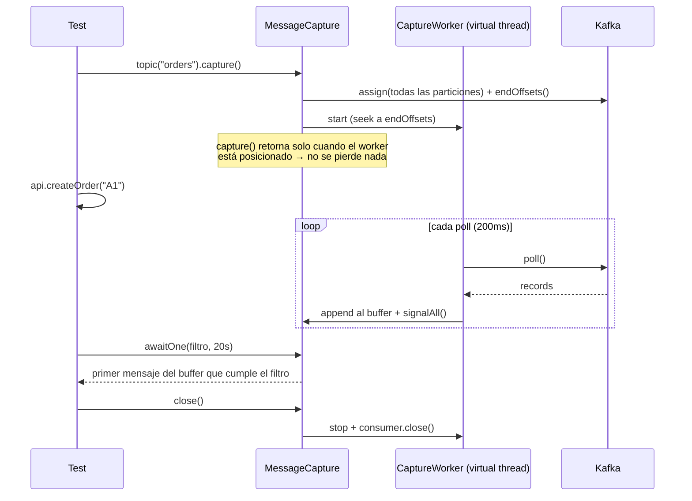

# 06 · Capturas, esperas y filtros

Este es el núcleo de valor de la librería: verificar eventos **sin `Thread.sleep()` y sin condiciones de carrera**.

## 1. El problema

```java
// ❌ Frágil
api.createOrder("A1");
Thread.sleep(3000);
var msgs = readLastMessages("orders", 10);
assertTrue(msgs.stream().anyMatch(m -> m.contains("A1")));
```

- Si el evento tarda 3,1 s, el test falla.
- Si tarda 50 ms, se pierden 2,95 s.
- Si otro test publica 10 mensajes a la vez, el nuestro puede quedar fuera de "los últimos 10".
- Si se lee desde el principio, en entornos compartidos hay millones de mensajes.

## 2. La solución: `MessageCapture`

```java
try (MessageCapture capture = kit.topic("orders").capture()) {   // 1. empieza a escuchar AHORA
    api.createOrder("A1");                                         // 2. actúa
    KafkaMessage m = capture.awaitOne(Filters.key("A1"));          // 3. espera lo justo
}
```



### Garantías

1. **Posicionamiento previo**: `capture()` no retorna hasta que el consumidor está asignado y posicionado en los offsets *end* de cada partición. Todo lo publicado después de que `capture()` retorne será visto.
2. **Aislamiento**: nunca ve mensajes anteriores a su creación (salvo `CaptureOptions.from(...)`).
3. **Espera eficiente**: `await*` se bloquea sobre una `Condition` y se despierta al llegar mensajes; retorna en cuanto se cumple, sin esperar el timeout.
4. **Particiones nuevas**: si se añaden particiones durante la captura, se detectan (refresco de metadatos cada `metadata.max.age.ms` configurado a 5 s) y se asignan desde el principio.
5. **Sin consumer group**: no afecta al sistema bajo prueba.

## 3. API de `MessageCapture`

```java
public interface MessageCapture extends AutoCloseable {

    // --- Esperas positivas ---
    KafkaMessage awaitOne(Predicate<KafkaMessage> filter);                       // timeout por defecto
    KafkaMessage awaitOne(Predicate<KafkaMessage> filter, Duration timeout);
    KafkaMessage awaitFirst();                                                    // cualquier mensaje
    List<KafkaMessage> awaitCount(int n, Predicate<KafkaMessage> filter);          // al menos n
    List<KafkaMessage> awaitCount(int n, Predicate<KafkaMessage> filter, Duration timeout);
    List<KafkaMessage> awaitExactly(int n, Predicate<KafkaMessage> filter, Duration settle); // n y ninguno más durante 'settle'
    List<KafkaMessage> awaitSequence(List<Predicate<KafkaMessage>> ordered, Duration timeout); // en orden (por timestamp)
    KafkaMessage awaitUntil(Predicate<List<KafkaMessage>> condition, Duration timeout);        // condición sobre el conjunto

    // --- Esperas negativas ---
    void assertNone(Predicate<KafkaMessage> filter, Duration window);    // espera 'window' completa; falla si aparece
    void assertNoneSoFar(Predicate<KafkaMessage> filter);                // comprueba lo recibido hasta ahora, sin esperar

    // --- Consulta del buffer ---
    List<KafkaMessage> messages();                                       // snapshot
    List<KafkaMessage> messages(Predicate<KafkaMessage> filter);
    int size();
    void clear();                                                        // vacía buffer (útil entre pasos)

    // --- Estado ---
    Map<Integer, Long> startOffsets();
    Map<Integer, Long> currentPositions();
    boolean isRunning();
    Optional<Throwable> failure();    // si el worker murió (p. ej. auth), los await la relanzan

    @Override void close();
}
```

### Semántica de "consumo" en el buffer

`awaitOne` **no elimina** el mensaje del buffer por defecto: dos `awaitOne` con filtros que casan con el mismo mensaje devuelven el mismo mensaje. Para flujos del tipo "espera el siguiente", existe `CaptureOptions.consuming(true)`: cada mensaje devuelto por un `await*` se marca y no vuelve a devolverse.

```java
try (var cap = kit.topic("orders").capture(CaptureOptions.defaults().consuming(true))) {
    api.createOrders(3);
    var first  = cap.awaitOne(Filters.any());
    var second = cap.awaitOne(Filters.any());   // distinto de first
}
```

### `CaptureOptions`

| Opción | Defecto | Descripción |
|--------|---------|-------------|
| `from(ReadSpec.Position)` | `END` | Permite capturar desde antes (p. ej. `fromAgo(30s)`) |
| `partitions(int...)` | todas | |
| `filter(Predicate)` | ninguno | Pre-filtro: solo se guardan en buffer los que cumplen (ahorra memoria en topics con mucho tráfico) |
| `maxBuffered(int)` | `defaults.capture.maxBufferedMessages` | Al superarlo se descartan los más antiguos y se registra un warning |
| `consuming(boolean)` | `false` | Ver arriba |
| `defaultTimeout(Duration)` | `defaults.timeouts.await` | |

## 4. Filtros (`Filters`)

Todos devuelven `MessageFilter`, que implementa `Predicate<KafkaMessage>` y añade `and`, `or`, `negate` y una **descripción legible** usada en los errores.

```java
public interface MessageFilter extends Predicate<KafkaMessage> {
    String describe();                        // "key == 'A1' AND $.status == 'CREATED'"
    MessageFilter and(Predicate<KafkaMessage> other);
    MessageFilter or(Predicate<KafkaMessage> other);
}
```

| Filtro | Ejemplo | Descripción |
|--------|---------|-------------|
| `any()` | | Todos |
| `key(Object)` | `key("A1")` | Igualdad de clave (compara con la forma `Map`/String) |
| `keyMatches(String regex)` | `keyMatches("A\\d+")` | |
| `header(name, value)` | `header("eventType","OrderCreated")` | |
| `headerExists(name)` | | |
| `headerMatches(name, regex)` | | |
| `field(path, value)` | `field("customer.id", 42)` | Ruta con puntos sobre `valueAsMap()`; admite índices `items[0].sku` |
| `field(path, Predicate)` | `field("amount", v -> ((Number) v).doubleValue() > 100)` | |
| `fieldExists(path)` | | |
| `jsonPath(expr, value)` | `jsonPath("$.items[?(@.sku=='X')]", notEmpty())` | JsonPath de Jayway sobre el JSON del valor |
| `jsonPath(expr, Predicate)` | | |
| `valueContains(Map)` | `valueContains(Map.of("status","CREATED"))` | Subconjunto profundo (como `match contains` de Karate) |
| `valueEquals(Object)` | | Igualdad profunda |
| `valueMatches(String regex)` | | Sobre `valueAsString()` |
| `partition(int)` | | |
| `schemaId(int)` | | |
| `tombstone()` | | `value == null` |
| `timestampAfter(Instant)` / `timestampBefore(Instant)` | | |
| `allOf(...)`, `anyOf(...)`, `not(...)` | | Composición |

Comparación de números: `field("amount", 10)` casa con `10`, `10L`, `10.0` (normalización numérica), para evitar sorpresas entre Avro `int`/`long` y JSON.

### Ejemplos

```java
Filters.key("A1").and(Filters.header("eventType", "OrderCreated"));

Filters.allOf(
        Filters.field("orderId", orderId),
        Filters.field("status", "PAID"),
        Filters.jsonPath("$.lines.length()", 3));

Filters.valueContains(Map.of(
        "orderId", orderId,
        "customer", Map.of("country", "ES")));
```

## 5. Capturas multi-topic y flujos

Para verificar coreografías (un evento dispara otros en cadena):

```java
try (MultiTopicCapture cap = kit.capture("orders", "payments", "audit")) {
    api.checkout(cartId);

    cap.awaitSequence(List.of(
            on("orders",   Filters.field("cartId", cartId).and(Filters.field("status", "CREATED"))),
            on("payments", Filters.field("cartId", cartId).and(Filters.field("status", "AUTHORIZED"))),
            on("orders",   Filters.field("cartId", cartId).and(Filters.field("status", "PAID")))),
        Duration.ofSeconds(30));

    cap.topic("audit").awaitCount(3, Filters.field("correlationId", cartId));
}
```

- Los topics pueden pertenecer a **clusters distintos**.
- El orden de `awaitSequence` se evalúa por timestamp del mensaje (los relojes de productores distintos pueden desviarse; se documenta el riesgo y se admite `sequenceTolerance(Duration)`).

## 6. Diagnóstico en timeouts

Un buen mensaje de error ahorra horas. `KafkaAwaitTimeoutException`:

```
KafkaAwaitTimeoutException: no llegó ningún mensaje que cumpla el filtro en 20s
  topic:    orders (dev.orders.v1) @ cluster main
  filtro:   key == 'A1' AND header eventType == 'OrderCreated'
  capturados desde el inicio de la captura: 7 mensajes (particiones 0..5)
  últimos 5 mensajes (más recientes primero):
    [3]@10452  2026-09-25T10:15:31Z key=A1  headers={eventType=OrderUpdated}  value={"orderId":"A1","status":"UPDATED"...}
    [1]@88121  2026-09-25T10:15:30Z key=B7  headers={eventType=OrderCreated}  value={"orderId":"B7",...}
    ...
  coincidencias parciales:
    [3]@10452 cumple 'key == A1' pero NO 'header eventType == OrderCreated' (valor: 'OrderUpdated')
```

- La sección de **coincidencias parciales** se calcula evaluando cada parte de un `and` por separado, lo que suele señalar directamente la causa.
- Si el worker ha fallado (autorización, deserialización fatal, broker caído), el `await` lanza inmediatamente con la causa original, sin esperar al timeout.
- La excepción expone `capturedMessages()`, `filter()` y `timeout()` para inspección programática.

## 7. Implementación del worker

```java
final class CaptureWorker implements Runnable {
    private final Consumer<byte[], byte[]> consumer;      // bytes: la deserialización se hace fuera del poll
    private final CaptureBuffer buffer;
    private final CountDownLatch positioned = new CountDownLatch(1);
    private volatile boolean running = true;

    @Override public void run() {
        try {
            var parts = partitions();
            consumer.assign(parts);
            consumer.endOffsets(parts).forEach(consumer::seek);
            parts.forEach(consumer::position);            // fuerza la resolución de posiciones
            positioned.countDown();
            while (running) {
                var records = consumer.poll(pollInterval);
                if (!records.isEmpty()) buffer.appendAll(toMessages(records));   // signalAll dentro
                maybeRefreshPartitions();
            }
        } catch (WakeupException e) {
            // cierre normal
        } catch (Exception e) {
            buffer.fail(e);                               // despierta a los await con el error
        } finally {
            consumer.close(Duration.ofSeconds(5));
        }
    }

    void stop() { running = false; consumer.wakeup(); }
}
```

Decisiones:

- El consumidor usa `ByteArrayDeserializer` y la deserialización real se hace en `toMessages` con el `SerdeRegistry`: así un mensaje que no se puede deserializar se guarda con `problem()` en vez de romper el `poll()`.
- Se lanza con `Thread.ofVirtual().name("kafka-testkit-capture-" + topic + "-", n).start(worker)`.
- `capture()` espera `positioned.await(timeouts.request)`; si no se posiciona a tiempo lanza con la causa (normalmente conectividad o permisos).

## 8. Awaitility y otras librerías

`MessageCapture` no depende de Awaitility, pero se integra bien si el proyecto ya la usa:

```java
await().atMost(20, SECONDS).until(() -> capture.messages(Filters.key("A1")).size() == 2);
```

## 9. Buenas prácticas

- Crear la captura **antes** de la acción, siempre.
- Filtrar por algo **único del test** (id generado, `traceId`) para no depender de otros tests que compartan topic.
- Usar `assertNone` solo con ventanas cortas y justificadas; alarga la ejecución.
- Cerrar las capturas (`try-with-resources`); en Karate se cierran solas al cerrar el kit, pero conviene `cap.close()`.
- Preferir `valueContains` o `field` a igualdad completa: los eventos suelen llevar campos variables (timestamps, ids).
