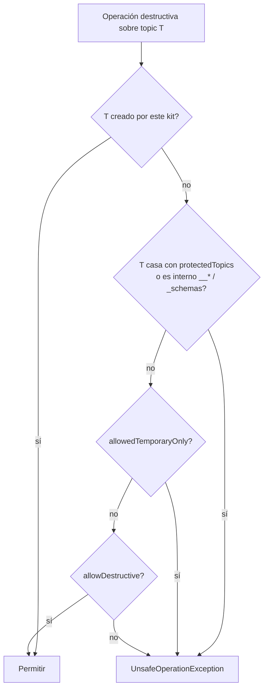

# 07 · Metadatos, admin de test y consumer groups

Las tres áreas se exponen desde `ClusterClient` y se implementan sobre un único `Admin` de Kafka por cluster (cacheado en `ClientPool`). Todas las operaciones usan `timeouts.request` salvo que se indique otro.

```java
ClusterClient main = kit.cluster("main");
main.metadata();   // lectura: nunca modifica nada
main.admin();      // modificación de topics (con política de protección)
main.groups();     // consumer groups: lectura + operaciones protegidas
```

Los métodos que reciben un nombre de topic aceptan **tanto el nombre lógico como el físico**: primero se busca en `topics:` del YAML; si no existe se asume físico.

---

## 1. Metadatos — `MetadataClient`

```java
public interface MetadataClient {
    ClusterInfo clusterInfo();
    Set<String> listTopics();                              // excluye internos
    Set<String> listTopics(boolean includeInternal);
    Set<String> listTopics(String regex);
    boolean topicExists(String topic);

    TopicDescription describeTopic(String topic);
    Map<String, String> topicConfig(String topic);         // configs efectivas (no por defecto incluidas)
    Map<String, ConfigEntryInfo> topicConfigDetailed(String topic); // valor + fuente (DEFAULT, DYNAMIC_TOPIC...) + sensible

    TopicOffsets offsets(String topic);                    // earliest/latest por partición
    long messageCount(String topic);                       // Σ(latest - earliest), aproximado (compactación, transacciones)
    Map<Integer, Long> offsetsForTimestamp(String topic, Instant ts);

    Map<String, String> brokerConfig(int brokerId);
    List<AclInfo> acls(String topic);                      // si el usuario tiene permiso de Describe ACL
}
```

### Modelos

```java
public record ClusterInfo(String clusterId, BrokerInfo controller, List<BrokerInfo> brokers) {}
public record BrokerInfo(int id, String host, int port, Optional<String> rack) {}

public record TopicDescription(
        String name, boolean internal, Uuid topicId,
        List<PartitionInfo> partitions) {
    int partitionCount();
    int replicationFactor();
    boolean allPartitionsInSync();          // ISR == réplicas en todas
    List<PartitionInfo> underReplicated();
}

public record PartitionInfo(int partition, int leader, List<Integer> replicas, List<Integer> isr) {}

public record TopicOffsets(String topic, Map<Integer, PartitionOffsets> partitions) {
    long totalMessages();
}
public record PartitionOffsets(int partition, long earliest, long latest) {
    long size() { return latest - earliest; }
}
```

Todos tienen `toMap()` para Karate.

### Ejemplos

```java
var d = kit.cluster("main").metadata().describeTopic("orders");
assertThat(d.partitionCount()).isEqualTo(6);
assertThat(d.replicationFactor()).isEqualTo(3);
assertThat(d.allPartitionsInSync()).isTrue();

var cfg = kit.cluster("main").metadata().topicConfig("orders");
assertThat(cfg).containsEntry("retention.ms", "604800000")
               .containsEntry("cleanup.policy", "delete");
```

Test de "contrato de infraestructura" típico: comparar la `definition` declarada en el YAML con la realidad:

```java
TopicDefinitionReport report = kit.cluster("main").metadata().verifyDefinition("orders");
assertThat(report.differences()).isEmpty();
// differences: [partitions: esperado 6, real 3; config retention.ms: esperado 604800000, real 86400000]
```

---

## 2. Admin de test — `TopicAdmin`

```java
public interface TopicAdmin {
    // Creación
    void createTopic(NewTopicSpec spec);
    void createTopic(String name, int partitions, short replicationFactor);
    String createTemporaryTopic();                              // "<prefix><uuid8>", 1 partición, RF por defecto del broker
    String createTemporaryTopic(NewTopicSpec spec);             // nombre generado a partir de spec.name() como prefijo
    void ensureTopic(String logicalTopic);                      // crea según 'definition' del YAML si no existe

    // Modificación
    void addPartitions(String topic, int totalPartitions);
    void alterTopicConfig(String topic, Map<String, String> configs);

    // Destructivas (protegidas)
    void deleteTopic(String topic);
    void purgeTopic(String topic);                              // deleteRecords hasta latest en todas las particiones
    void purgePartition(String topic, int partition, long beforeOffset);
}
```

```java
NewTopicSpec.name("qa.orders.tmp").partitions(3).replicationFactor((short) 1)
        .config("retention.ms", "3600000")
        .config("cleanup.policy", "compact");
```

### 2.1 Comportamiento

- Todas las operaciones son **síncronas** y esperan a que el cambio sea visible: tras `createTopic` se consulta `describeTopics` hasta que todas las particiones tienen líder (evita el típico `UNKNOWN_TOPIC_OR_PARTITION` en el primer `send`).
- `createTopic` de un topic existente lanza `TopicAlreadyExistsException` salvo `spec.ifNotExists()`.
- `purgeTopic` no funciona en topics `cleanup.policy=compact` (limitación de Kafka): se lanza `AdminOperationException` explicándolo y sugiriendo borrar y recrear.
- `createTemporaryTopic` registra el topic en el kit; al cerrar el kit se borran **siempre** (aunque `allowDestructive=false`, porque los ha creado el propio kit).

### 2.2 Política de protección

Evaluada antes de cada operación destructiva, en este orden:



Mensaje de error:

```
UnsafeOperationException: purgeTopic('dev.orders.v1') bloqueado en cluster 'main':
  clusters.main.admin.allowDestructive = false.
  Para permitirlo en este entorno añade en el YAML:
    environments.<env>.clusters.main.admin.allowDestructive: true
```

Se puede elevar puntualmente en código (queda en el log a WARN):

```java
kit.cluster("main").admin().unsafe().purgeTopic("orders");
```

`unsafe()` solo salta `allowDestructive`; **nunca** salta `protectedTopics` ni los topics internos.

---

## 3. Consumer groups — `ConsumerGroupClient`

```java
public interface ConsumerGroupClient {
    // Lectura
    List<GroupListing> list();                                  // id, estado, tipo (classic/consumer)
    List<GroupListing> list(String regex);
    boolean exists(String groupId);
    GroupDescription describe(String groupId);
    Map<TopicPartitionRef, Long> committedOffsets(String groupId);
    GroupLag lag(String groupId);
    GroupLag lag(String groupId, String topic);

    // Esperas
    GroupLag awaitLag(String groupId, String topic, long maxLag, Duration timeout);
    GroupDescription awaitState(String groupId, GroupState state, Duration timeout);
    GroupDescription awaitMembers(String groupId, int minMembers, Duration timeout);
    void awaitCommittedOffset(String groupId, String topic, int partition, long offset, Duration timeout);

    // Destructivas (protegidas por la misma política)
    void resetOffsets(String groupId, String topic, OffsetResetSpec to);
    void deleteGroup(String groupId);
    void deleteOffsets(String groupId, String topic);
}
```

### Modelos

```java
public record GroupDescription(String groupId, GroupState state, String protocol,
                               String partitionAssignor, int coordinatorId,
                               List<MemberInfo> members) {}
public record MemberInfo(String memberId, String clientId, String host,
                         List<TopicPartitionRef> assignment) {}

public record GroupLag(String groupId, long total, Map<TopicPartitionRef, PartitionLag> partitions) {
    long lagFor(String topic);
    boolean isZero();
}
public record PartitionLag(long committed, long endOffset, long lag) {}   // committed = -1 si nunca comprometió
```

Cálculo del lag: `listConsumerGroupOffsets` + `listOffsets(latest)`; lag = `end - committed`. Si la partición no tiene offset comprometido, el lag se calcula contra `earliest` y se marca `committed = -1`.

### `awaitLag` — verificar que el servicio procesó todo

CU-04: "publico N eventos y quiero saber que el servicio los ha consumido":

```java
kit.topic("payments").sendAll(payments);
kit.cluster("main").groups()
   .awaitLag("payments-service", "payments", 0, Duration.ofSeconds(60));
// ahora se puede verificar el efecto (BD, API...)
```

Detalles:
- Se consulta cada `timeouts.poll × 5` (1 s por defecto) para no saturar el coordinador.
- Si el grupo **no existe** o está `EMPTY` durante todo el timeout, el error lo dice explícitamente ("¿está arrancado el servicio? ¿el group.id es correcto?").
- El error de timeout muestra el lag por partición en el último sondeo.

### `resetOffsets`

```java
OffsetResetSpec.toEarliest();
OffsetResetSpec.toLatest();
OffsetResetSpec.toOffset(Map.of(0, 100L, 1, 250L));
OffsetResetSpec.toTimestamp(Instant.parse("2026-09-25T08:00:00Z"));
OffsetResetSpec.shiftBy(-10);
```

Requisitos: grupo en estado `EMPTY` o `DEAD` (Kafka no permite alterar offsets de un grupo activo); si no, `AdminOperationException` indicando los miembros activos. Protegido por la política de §2.2 (se evalúa sobre el topic).

---

## 4. Uso desde Karate (adelanto)

```gherkin
* def topic = kafka.describeTopic('orders')
* match topic.partitionCount == 6
* match each topic.partitions contains { isr: '#[3]' }

* def lag = kafka.awaitLag('payments-service', 'payments', 0, '60s')
* match lag.total == 0
```

Ver [09 · Karate](09-integracion-karate.md).
