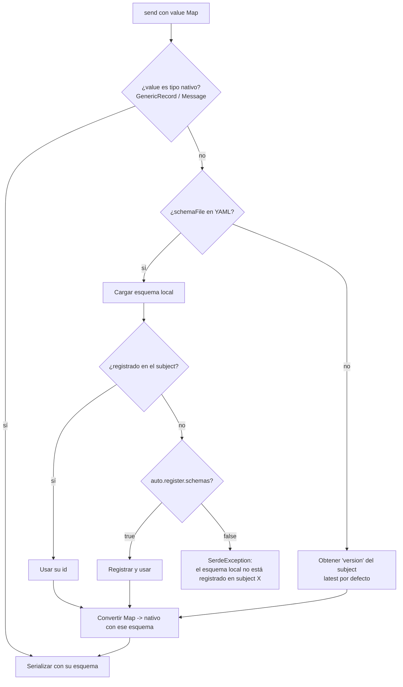

# 08 · Serdes y Schema Registry

## 1. Formatos soportados

| `SerdeFormat` | Módulo | Serializador base | Valor Java al leer | `valueAsMap()` |
|---------------|--------|-------------------|--------------------|----------------|
| `STRING` | core | `StringSerializer` | `String` | Si el string es JSON objeto → Map; si no, error |
| `JSON` | core | Jackson | `JsonNode` | Sí |
| `BYTES` | core | `ByteArraySerializer` | `byte[]` | No (error explicativo); `valueAsString()` da Base64 |
| `LONG` | core | `LongSerializer` | `Long` | No |
| `INTEGER` | core | `IntegerSerializer` | `Integer` | No |
| `AVRO` | schema-registry | `KafkaAvroSerializer` | `GenericRecord` (o clase específica) | Sí |
| `PROTOBUF` | schema-registry | `KafkaProtobufSerializer` | `DynamicMessage` (o clase generada) | Sí |
| `JSON_SCHEMA` | schema-registry | `KafkaJsonSchemaSerializer` | `JsonNode` | Sí |

## 2. SPI: `SerdeProvider`

```java
public interface SerdeProvider {
    /** Formatos que este provider sabe manejar. */
    Set<SerdeFormat> formats();

    /** Construye el serde para un lado (key/value) de un topic concreto. */
    TestSerde create(SerdeContext context);
}

public record SerdeContext(
        SerdeFormat format,
        boolean isKey,
        TopicConfig topic,
        ClusterConfig cluster,
        SerdeConfig serdeConfig,
        Map<String, Object> nativeProperties,   // ya resueltas (incluye schema registry)
        ResourceLoader resources) {}

public interface TestSerde extends AutoCloseable {
    byte[] serialize(String topic, Headers headers, Object value);       // acepta Map/String/nativo
    Object deserialize(String topic, Headers headers, byte[] data);      // tipo nativo del formato
    Object toPlain(Object nativeValue);                                   // Map / List / String / Number / Boolean / null
    Optional<Integer> schemaId(byte[] data);                              // del wire format si aplica
}
```

`SerdeFormat` es un **string extensible** (no un enum cerrado) para permitir formatos de terceros:

```java
public record SerdeFormat(String name) {
    public static final SerdeFormat STRING = new SerdeFormat("STRING");
    public static final SerdeFormat AVRO = new SerdeFormat("AVRO");
    // ...
}
```

Registro por `ServiceLoader` (`META-INF/services/io.github.volumidev.kafkatestkit.serde.SerdeProvider`):

```
# kafka-testkit-core
io.github.volumidev.kafkatestkit.serde.builtin.BuiltinSerdeProvider
# kafka-testkit-schema-registry
io.github.volumidev.kafkatestkit.schemaregistry.ConfluentSerdeProvider
```

`SerdeRegistry` detecta duplicados (dos providers para el mismo formato) y falla al arrancar, salvo que el YAML fije `defaults.serde.providers.AVRO: com.acme.MyAvroProvider`.

### Formato personalizado (ejemplo: XML)

```java
public final class XmlSerdeProvider implements SerdeProvider {
    public Set<SerdeFormat> formats() { return Set.of(new SerdeFormat("XML")); }
    public TestSerde create(SerdeContext ctx) { return new XmlSerde(ctx); }
}
```

```yaml
topics:
  legacy-invoices:
    cluster: legacy
    value: { format: XML }
```

## 3. Formatos básicos (core)

### JSON
- Serializa `Map`, `List`, POJO, `JsonNode` con un `ObjectMapper` configurado: `JavaTimeModule`, fechas ISO-8601, sin fallar con propiedades desconocidas.
- Un `String` se valida como JSON y se envía tal cual (no se re-escapa).
- Al leer: `JsonNode`; `toPlain` → `Map`/`List`.
- Mensaje no JSON → `DeserializationProblem` ("byte 0: 'H' no es JSON válido; ¿el topic es STRING?").

### STRING
- `charset` configurable.
- `valueAsMap()` intenta parsear JSON por comodidad (muchos sistemas envían JSON como String).

### BYTES
- Envío: `byte[]`, `ByteBuffer`, o `String` con prefijo `base64:` / `hex:`.
- Lectura: `byte[]`; `toPlain` → String Base64 (para que Karate pueda mostrarlo y compararlo).
- `KafkaMessage.rawValue()` siempre disponible en cualquier formato.

## 4. Schema Registry (módulo `kafka-testkit-schema-registry`)

### 4.1 Wire format

Los tres formatos usan el wire format de Confluent: `0x00 | schemaId (4 bytes) | payload` (Protobuf añade índices de mensaje). La librería usa los serializers de Confluent para garantizar compatibilidad total con las aplicaciones reales.

### 4.2 Resolución del esquema al PRODUCIR



- Esquemas cacheados por (subject, versión) durante la vida del kit.
- `version: latest` se resuelve **una vez** por kit (no en cada envío), para que un test no cambie de esquema a mitad de ejecución. `kit.schemaRegistry("main").refresh()` fuerza la recarga.

### 4.3 Resolución del esquema al LEER

Siempre por el `schemaId` del mensaje (se consulta el registry y se cachea). No se necesita `schemaFile` para leer.

### 4.4 AVRO

Conversión `Map → GenericRecord` (`AvroMapConverter`):

| Tipo Avro | Acepta desde Map | Devuelve en `toPlain` |
|-----------|------------------|-----------------------|
| `record` | `Map` | `Map` (orden de campos del esquema) |
| `enum` | `String` | `String` |
| `array` | `List` | `List` |
| `map` | `Map<String,?>` | `Map` |
| `union [null, X]` | `null` o valor de X | valor o `null` |
| `union [A, B]` (no nula) | valor que case con un solo tipo, o `{"B": valor}` (JSON encoding de Avro) | valor sin envoltorio |
| `fixed` / `bytes` | `byte[]` o `String` Base64 | `String` Base64 |
| `int`/`long`/`float`/`double` | cualquier `Number` o String numérico (con comprobación de rango) | `Number` |
| logical `timestamp-millis/micros` | `Instant`, `String` ISO-8601 o epoch `Number` | `String` ISO-8601 |
| logical `date` | `LocalDate`, `String` `yyyy-MM-dd`, `int` | `String` `yyyy-MM-dd` |
| logical `decimal` | `BigDecimal`, `String`, `Number` | `String` decimal exacto (evita perder precisión) |
| logical `uuid` | `UUID`, `String` | `String` |
| campo ausente con `default` | — | se aplica el default |
| campo ausente sin default | — | `SerdeException` ("campo obligatorio 'amount' ausente en Order") |
| campo extra no en esquema | — | `SerdeException` salvo `serde.properties.ignoreUnknownFields: true` |

Opción `specificClass` para obtener clases generadas (`SpecificRecord`) en vez de `GenericRecord` (requiere las clases en el classpath de test).

### 4.5 PROTOBUF

- `Map → DynamicMessage` vía `JsonFormat.parser()` sobre el JSON del Map, usando el descriptor del esquema.
- `DynamicMessage → Map` vía `JsonFormat.printer().preservingProtoFieldNames().includingDefaultValueFields()` y parseo a Map. Nombres de campo **tal cual en el .proto** (snake_case) por defecto; `serde.properties.jsonNames: true` para camelCase.
- `messageType` obligatorio si el esquema define varios mensajes de primer nivel y no se usa `specificClass`.
- `int64`/`uint64` se representan como `String` en JSON (norma de Protobuf); los filtros `field()` normalizan número/string numérico para compararlos.
- `google.protobuf.Timestamp` → ISO-8601; `Any`, `oneof`, `map`, `repeated` soportados vía `JsonFormat`.

### 4.6 JSON_SCHEMA

- Envío desde `Map`/POJO/`String`; se valida contra el esquema antes de enviar (`json.fail.invalid.schema=true` por defecto en tests: un test que envía datos inválidos debe fallar en el test, no en el consumidor).
- Lectura a `JsonNode` → `Map`.

### 4.7 Cliente de Schema Registry expuesto

```java
public interface SchemaRegistryClient {
    List<String> subjects();
    List<Integer> versions(String subject);
    SchemaInfo latest(String subject);
    SchemaInfo version(String subject, int version);
    SchemaInfo byId(int id);
    SchemaInfo forTopic(String logicalTopic, boolean isKey);      // según subjectNameStrategy
    CompatibilityResult testCompatibility(String subject, String schema, SchemaType type);
    String compatibilityLevel(String subject);
    int register(String subject, String schema, SchemaType type);  // protegido: requiere allowDestructive o auto.register
    void refresh();
}

public record SchemaInfo(int id, String subject, int version, SchemaType type,
                         String schema, List<SchemaReference> references) {
    Map<String, Object> toMap();
}
```

Casos de uso de contrato:

```java
var sr = kit.schemaRegistry("main");
var local = Files.readString(Path.of("src/main/avro/order.avsc"));
assertThat(sr.testCompatibility("dev.orders.v1-value", local, SchemaType.AVRO).compatible()).isTrue();

KafkaMessage m = capture.awaitOne(Filters.key("A1"));
assertThat(m.valueSchemaId()).contains(sr.latest("dev.orders.v1-value").id());
```

## 5. Errores de (de)serialización

`SerdeException` siempre incluye: topic, lado (key/value), formato, subject/schemaId si aplica, **ruta del campo** problemático y valor recibido:

```
SerdeException: no se pudo serializar el value de 'orders' (AVRO, subject dev.orders.v1-value v7):
  campo 'lines[1].quantity': esperado int, recibido String "dos"
```

En lectura, los errores no abortan capturas ni lecturas: el mensaje se conserva con `problem()` (ver [05 §5.2](05-api-core.md#52-implementación-de-la-lectura)).
