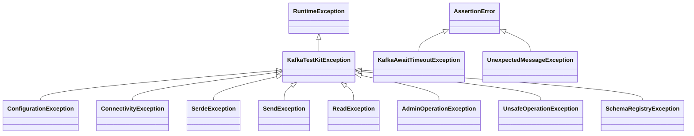

# 11 · Errores, logging y observabilidad

## 1. Jerarquía de excepciones

Todas son **unchecked** (los tests no deberían llenarse de `throws`) y viven en `io.github.volumidev.kafkatestkit.exception`.



| Excepción | Cuándo | Información adjunta |
|-----------|--------|---------------------|
| `ConfigurationException` | YAML inválido, variables sin resolver, referencias rotas, ficheros no encontrados | `List<ConfigError>` (ruta YAML, mensaje, sugerencia) |
| `ConnectivityException` | No se alcanza un broker/registry en `timeouts.request`; fallo de TLS/autenticación | cluster, bootstrap, causa raíz clasificada (DNS, TLS, AUTH, TIMEOUT) |
| `SerdeException` | Fallo al serializar (o al deserializar con `failOnDeserializationError`) | topic, lado, formato, subject/id, ruta del campo |
| `SendException` | El broker rechaza el envío (autorización, tamaño, topic inexistente) | topic, partición, código de error Kafka |
| `ReadException` | Fallo al leer (autorización, offsets fuera de rango) | topic, particiones |
| `AdminOperationException` | Fallo de una operación admin | operación, recurso, código Kafka |
| `UnsafeOperationException` | Operación destructiva bloqueada por política | operación, recurso, regla que la bloquea, cómo permitirla |
| `SchemaRegistryException` | Errores del registry (subject inexistente, incompatibilidad) | url, subject, código HTTP |
| `KafkaAwaitTimeoutException` | Un `await*` no se cumple a tiempo | filtro, timeout, mensajes capturados, coincidencias parciales |
| `UnexpectedMessageException` | `assertNone` detecta un mensaje prohibido | filtro, mensaje encontrado |

**Por qué las de espera extienden `AssertionError`**: los frameworks (JUnit, TestNG, Karate) las reportan como **fallo** del test, no como **error**, que es semánticamente correcto: el sistema no hizo lo esperado.

## 2. Clasificación de errores de conectividad

Los errores de Kafka en conexión son notoriamente crípticos. La librería los traduce:

| Síntoma original | Clasificación | Mensaje |
|------------------|---------------|---------|
| `TimeoutException: Timed out waiting for a node assignment` | `TIMEOUT` | No hay respuesta de `broker1:9093` en 15s. Comprueba red/VPN, `bootstrapServers` y el `protocol` (¿SSL vs PLAINTEXT?) |
| `SslHandshakeException … PKIX path building failed` | `TLS_TRUST` | El certificado del broker no es de confianza: revisa `security.ssl.truststore` |
| `SslHandshakeException … No subject alternative names` | `TLS_HOSTNAME` | El hostname no coincide con el certificado; revisa `bootstrapServers` o (solo en local) `ssl.endpointIdentification: ""` |
| `SaslAuthenticationException` | `AUTH` | Credenciales rechazadas para el usuario `qa-user` (mecanismo SCRAM-SHA-512) |
| `TopicAuthorizationException` | `AUTHZ` | El usuario no tiene permiso `READ`/`WRITE`/`DESCRIBE` sobre `dev.orders.v1` |
| `UnknownTopicOrPartitionException` | `NOT_FOUND` | El topic `dev.orders.v1` no existe en `main`. ¿Nombre físico correcto? Topics parecidos: `dev.orders.v2` |

La causa original siempre se conserva (`getCause()`).

## 3. Logging

- API: **solo `slf4j-api`**. El proyecto usuario decide la implementación (Logback, Log4j2…). Karate ya trae Logback.
- Loggers por área para poder filtrar:

| Logger | Nivel útil | Contenido |
|--------|-----------|-----------|
| `kafkatestkit.config` | INFO | Fichero cargado, entorno, clusters y topics (secretos enmascarados) |
| `kafkatestkit.produce` | DEBUG | `→ orders[2]@1045 key=A1 headers={...} value=<truncado>` |
| `kafkatestkit.consume` | DEBUG | `← orders[2]@1046 key=A1 ...` |
| `kafkatestkit.capture` | DEBUG | Inicio/fin de capturas, posiciones, tamaño del buffer |
| `kafkatestkit.await` | INFO | `awaitOne(key == 'A1') satisfecho en 1.3s` |
| `kafkatestkit.admin` | INFO | Operaciones admin; WARN para `unsafe()` |
| `kafkatestkit.serde` | DEBUG | Esquemas resueltos y cacheados |

- Payloads según `defaults.logging.payloads`: `NONE`, `TRUNCATED` (por defecto, `maxPayloadChars`), `FULL`.
- Los logs internos de `kafka-clients` (muy verbosos a INFO) no se tocan: se documenta la recomendación de poner `org.apache.kafka` a `WARN` en el `logback-test.xml`.

Ejemplo de `logback-test.xml` recomendado:

```xml
<configuration>
  <appender name="STDOUT" class="ch.qos.logback.core.ConsoleAppender">
    <encoder><pattern>%d{HH:mm:ss.SSS} %-5level [%thread] %logger{20} - %msg%n</pattern></encoder>
  </appender>
  <logger name="org.apache.kafka" level="WARN"/>
  <logger name="io.confluent" level="WARN"/>
  <logger name="kafkatestkit" level="INFO"/>
  <logger name="kafkatestkit.produce" level="DEBUG"/>
  <logger name="kafkatestkit.consume" level="DEBUG"/>
  <root level="INFO"><appender-ref ref="STDOUT"/></root>
</configuration>
```

## 4. Enmascarado de secretos

- `Secret` es un tipo envoltorio usado en el modelo de configuración para contraseñas, tokens y claves:

```java
public final class Secret {
    private final String value;
    public String reveal() { return value; }       // solo se usa al construir propiedades del cliente
    @Override public String toString() { return "****"; }
}
```

- Las propiedades nativas se registran con un `PropertiesMasker` que oculta cualquier clave que contenga `password`, `secret`, `token`, `jaas`, `key` (salvo `key.serializer`/`key.deserializer`), `basic.auth.user.info`.
- Los mensajes de excepción nunca incluyen secretos (tests unitarios específicos lo verifican).

## 5. Observabilidad del propio kit

Para depurar suites largas:

```java
KitStats s = kit.stats();
s.messagesSent();          // por topic
s.messagesReceived();      // por topic
s.activeCaptures();        // capturas abiertas (fuga si crece)
s.awaits();                // nº, tiempo medio y máximo de espera por filtro
```

Al cerrar el kit, si quedan capturas abiertas se loguea un WARN con dónde se crearon (stack trace capturado al crear la captura, solo si `kafkatestkit.capture` está en DEBUG).

Opcionalmente, en el módulo Karate, `KarateKafka.report()` devuelve estas estadísticas como `Map` para incluirlas en el informe.
