# 14 · Roadmap de implementación

Cada fase termina con `./mvnw verify` en verde y su documentación actualizada. Las fases 1–5 forman el **MVP (0.1.0)**, usable ya desde JUnit con JSON/String/bytes.

```mermaid
gantt
    dateFormat X
    axisFormat %s
    section MVP 0.1.0
    F1 Esqueleto              :f1, 0, 1
    F2 Configuración          :f2, after f1, 2
    F3 Producir/leer          :f3, after f2, 2
    F4 Testcontainers básico  :f4, after f2, 1
    F5 Capturas y esperas     :f5, after f3, 2
    section 0.2.0
    F6 Metadatos/admin/grupos :f6, after f5, 2
    F7 Schema Registry        :f7, after f5, 3
    section 0.3.0
    F8 Karate                 :f8, after f7, 2
    F9 Seguridad IT           :f9, after f6, 1
    section 1.0.0
    F10 Endurecimiento y release :f10, after f8, 2
```

(Duraciones relativas en unidades de esfuerzo, no fechas.)

---

## F1 · Esqueleto del proyecto
**Entregables**
- POM padre, BOM y los cinco módulos vacíos + `kafka-testkit-it`.
- Maven Wrapper, enforcer, spotless, checkstyle, spotbugs, jacoco, surefire/failsafe.
- `module-info.java` en core.
- Workflow de CI `build.yml`.
- Versiones de dependencias fijadas a las últimas estables compatibles.

**Criterios de aceptación**
- `./mvnw verify` pasa en local (Windows) y en CI (Linux).
- Un test trivial por módulo se ejecuta.

## F2 · Configuración
**Entregables**
- Records de configuración ([02 §4](02-arquitectura.md#4-modelo-de-dominio-de-configuración)).
- `YamlConfigLoader` (classpath/fichero, `include`, varios ficheros).
- `Interpolator`, `EnvironmentMerger`, overrides del builder.
- `ConfigValidator` con errores acumulados y sugerencias ("¿quisiste decir…?").
- `SecurityPropertiesMapper` para todos los mecanismos + `Secret` + `PropertiesMasker`.
- `ResourceLoader` (`classpath:` → fichero temporal para stores).
- `KafkaTestKit.load(...)` y `config().describe()`.

**Criterios de aceptación**
- Todos los tests unitarios de configuración y seguridad de [13 §2](13-estrategia-de-testing.md#2-tests-unitarios-sin-kafka).
- El YAML de ejemplo completo de [03 §10](03-configuracion-yaml.md#10-ejemplo-completo) carga en todos sus entornos.

## F3 · Producir y leer (formatos básicos)
**Entregables**
- `SerdeProvider` SPI + `SerdeRegistry` + serdes STRING, JSON, BYTES, LONG, INTEGER.
- `ClientPool`, `ProducerFactory`, `ConsumerFactory`.
- `TopicClient.send*`, `sendFromFile`, `read`, `readLast`, `readAt`, `stream`.
- `KafkaMessage`, `OutgoingMessage`, `SendResult`, `ReadSpec`.
- Topics dinámicos (`ClusterClient.topic(name, options)`).

**Criterios de aceptación**
- `ProduceReadIT` en verde.
- Un mensaje no deserializable no rompe una lectura.

## F4 · Testcontainers básico
**Entregables**
- `EmbeddedKafka` (Kafka KRaft, sin SR aún), overrides, `autoCreateTopics`.
- Extensión JUnit 5 `@KafkaTestKitContainers` / `@InjectKafkaTestKit`.
- `EmbeddedKafka.shared()`.

**Criterios de aceptación**
- Los ITs de F3 usan ya la extensión.

## F5 · Capturas, filtros y esperas
**Entregables**
- `MessageCapture`, `CaptureWorker` (virtual threads), `CaptureBuffer`.
- `Filters` completo + `MessageFilter.describe()`.
- Todas las esperas (`awaitOne`, `awaitCount`, `awaitExactly`, `awaitSequence`, `assertNone`…).
- `MultiTopicCapture`.
- `TimeoutDiagnostics` con coincidencias parciales.

**Criterios de aceptación**
- `CaptureIT` en verde, incluida la prueba repetida de "no se pierde el primer mensaje".
- `ConcurrencyIT` en verde.
- **Release 0.1.0** (repositorio corporativo o snapshot).

## F6 · Metadatos, admin y consumer groups
**Entregables**
- `MetadataClient` (incl. `verifyDefinition`), `TopicAdmin` (incl. temporales), `ConsumerGroupClient` (incl. `awaitLag`, `resetOffsets`).
- `DestructivePolicy` + `unsafe()`.
- `ensureTopic` según `definition`.

**Criterios de aceptación**
- `AdminIT` y `ConsumerGroupIT` en verde.
- Ninguna operación destructiva posible sobre topics protegidos (tests negativos).

## F7 · Schema Registry
**Entregables**
- Módulo `kafka-testkit-schema-registry`: `ConfluentSerdeProvider`, Avro, Protobuf, JSON Schema.
- `AvroMapConverter`, `ProtobufMapConverter`.
- Resolución de esquemas (`schemaFile`, `subject`, `version`, estrategias de subject).
- `SchemaRegistryClient`.
- Soporte SR en `EmbeddedKafka` y registro automático de `schemaFile`.

**Criterios de aceptación**
- `SchemaRegistryIT` en verde, incluida la interoperabilidad con serializers Confluent usados "a pelo".
- Error claro si se usa AVRO sin el módulo.
- **Release 0.2.0**.

## F8 · Adaptador Karate
**Entregables**
- `KarateKafka`, `KarateCapture`, `KarateMultiCapture`, `KarateFilters` (JSON, función JS, `match`), `KarateDurations`.
- Caché por (ubicación, entorno), `closeAll()`, `fromKit()`.
- Suite de features de ejemplo + servicio simulado.

**Criterios de aceptación**
- Suite Karate en verde con `parallel(8)`.
- Las features de [09 §6](09-integracion-karate.md#6-ejemplos-de-features) funcionan tal cual.

## F9 · Seguridad en integración
**Entregables**
- Generación de certificados en build.
- `EmbeddedSecurity` (SCRAM, mTLS).
- `SecurityScramIT`, `SecurityMtlsIT`, `ConnectivityErrorsIT`.
- **Release 0.3.0**.

## F10 · Endurecimiento y 1.0.0
**Entregables**
- Revisión de API pública, Javadoc completo, `japicmp` activado.
- `KitStats`, detección de capturas no cerradas.
- README definitivo, guía de migración desde utilidades ad-hoc, ejemplos en `examples/`.
- Perfil `release` y publicación (Maven Central y/o repositorio corporativo).

**Criterios de aceptación**
- Umbrales de calidad de [13 §6](13-estrategia-de-testing.md#6-criterios-de-calidad).
- Probado en al menos un proyecto real (piloto) con Karate + Avro + SASL_SSL.
- **Release 1.0.0**.

---

## Ideas para después de 1.0

| Idea | Valor |
|------|-------|
| Kafka Connect: estado de conectores y tareas | Tests de pipelines de integración |
| Mock/stub de consumidores ("responder a eventos"): escuchar un topic y responder en otro | Simular servicios dependientes |
| Grabación y reproducción (record/replay) de mensajes a fichero | Datos de prueba realistas |
| Generación de datos desde esquema Avro/Protobuf | Payloads válidos sin escribirlos |
| Soporte AWS Glue Schema Registry / Apicurio | Otros registries |
| MSK IAM y Azure Event Hubs como mecanismos de primer nivel | Cloud |
| Transacciones (`sendTransactional`, lectura `read_uncommitted` vs `read_committed`) | Probar exactly-once |
| Integración con Cucumber (glue steps listos) | Otros usuarios BDD |
| CLI (`kafka-testkit send/read/capture`) usando el mismo YAML | Depuración manual |

## Preguntas abiertas

1. **Coordenadas definitivas** (groupId, nombre, licencia) y destino de publicación (Maven Central vs Nexus corporativo).
2. Versiones concretas de Kafka/Confluent de los clusters de la empresa, para fijar las de los serializers y las imágenes de Testcontainers.
3. ¿Hay convención de headers corporativos (traceId, eventType…) que merezca soporte específico (p. ej. filtros o defaults)?
4. ¿Se usan estrategias de subject distintas de `TopicNameStrategy`?
5. ¿Hace falta soporte para Karate 2.x si se adopta durante el desarrollo?
